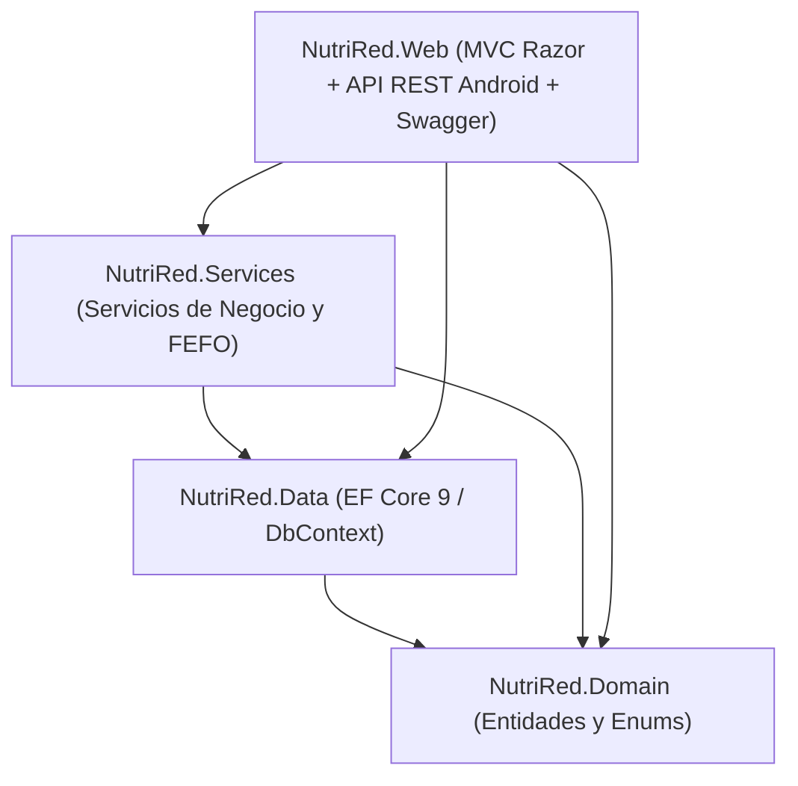

NutriRed - Sistema Inteligente e Inclusivo para la Gestión de Bancos de Alimentos


Proyecto final desarrollado para la **Universidad Tecnológica Nacional (UTN)** por el **Equipo 24 (CCS Nexus)**:
* **Cavallero, Pablo Andres**
* **Limache Caballero, Rosaura**
* **Sueldo, Martín**

## Descripción del Proyecto

**NutriRed** es una plataforma integral de arquitectura dual (Panel de Control Web + App Móvil Android) diseñada para optimizar y digitalizar la logística de los bancos de alimentos:
1. **Recepción ágil de donaciones:** Escaneo de códigos de barra comerciales y registro de lotes y vencimientos.
2. **Control FEFO (*First Expired, First Out*):** Priorización automática de lotes con fecha de caducidad más cercana para evitar desperdicio de alimentos.
3. **Armado Inteligente de Paquetes:** Sugerencia automática de kits según la cantidad de integrantes familiares, con soporte de sustitución ante faltantes y generación de código QR para rotulado.
4. **Despacho y Entrega en Terreno:** Verificación de receptores (titulares o terceros autorizados) y captura de firma digital de conformidad desde la app móvil.
5. **Métricas y Trazabilidad:** Seguimiento integral de la cadena de custodia: *Donante -> Lote -> Paquete -> Familia -> Voluntario*.

---

## Stack Tecnológico

* **Plataforma:** .NET 9 (`net9.0`)
* **Backend Web:** ASP.NET Core MVC (Vistas Razor + Tag Helpers + Bootstrap)
* **API REST:** Controladores ASP.NET Core con documentación interactiva en **Swagger UI** y soporte JWT para la app Android.
* **Acceso a Datos:** Entity Framework Core 9 (Code-First)
* **Base de Datos:** Microsoft SQL Server (`LocalDB` / `SQLEXPRESS`)
* **Herramientas:** Visual Studio 2022/2026

---

## Arquitectura de la Solución

El proyecto sigue una arquitectura en capas desacoplada con un proyecto web unificado:

```
NutriRed/
├── NutriRed.slnx               # Solución en formato XML moderno .NET 9
├── .gitignore                  # Exclusiones oficiales para .NET
├── README.md                   # Documentación del proyecto
└── src/
    ├── NutriRed.Domain/        # Entidades, Enums y Data Annotations
    ├── NutriRed.Data/          # NutriRedDbContext, Mapeos, Migraciones y Seed Data
    ├── NutriRed.Services/      # Lógica de negocio (Algoritmo FEFO, validaciones)
    └── NutriRed.Web/           # Aplicación Web MVC + API REST Android + Swagger
```



---

## Guía de Inicio Rápido para el Equipo

Sigue estos pasos para clonar y ejecutar el proyecto en tu máquina:

### 1. Requisitos Previos
* **.NET 9 SDK:** Verifica tenerlo instalado ejecutando en la consola:
  ```bash
  dotnet --version
  # Debe indicar una versión 9.0.x
  ```
* **SQL Server LocalDB:** Viene incluido con Visual Studio (marcando la carga de trabajo *"Desarrollo web y de ASP.NET"* o *"Almacenamiento y procesamiento de datos"*).
* **Herramienta EF Core CLI (Recomendada):**
  ```bash
  dotnet tool install --global dotnet-ef
  ```

### 2. Clonar el Repositorio
```bash
git clone https://github.com/TU_USUARIO/NutriRed.git
cd NutriRed
```

### 3. Restaurar y Compilar la Solución
```bash
dotnet build
```

### 4. Crear la Base de Datos y Aplicar Migraciones
Ejecuta la migración inicial contra tu SQL Server LocalDB:
```bash
dotnet ef database update --project src/NutriRed.Data --startup-project src/NutriRed.Web
```

### 5. Iniciar la Aplicación
```bash
dotnet run --project src/NutriRed.Web
```
*(O abre el archivo `NutriRed.slnx` en Visual Studio y presiona `F5`).*

---

## Puntos de Acceso

Una vez iniciada la aplicación, accede desde el navegador:

* **Panel Administrativo Web (MVC):** `http://localhost:5137`
* **Documentación Interactiva Swagger (API Móvil):** `http://localhost:5137/swagger`

---

## Datos de Prueba Iniciales

La aplicación incluye un sembrado automático de datos en desarrollo. Al iniciar la primera vez, se cargarán solos:

* **Categorías:** Legumbres/Granos, Lácteos, Harinas/Pastas, Aceites, Enlatados/Conservas, Infusiones.
* **Alimentos con códigos EAN reales de Argentina:**
  * `7790070412345`: Arroz Largo Fino 1kg
  * `7790040112233`: Fideos Tirabuzón 500g
  * `7790272001011`: Aceite de Girasol 900ml
  * `7793940000018`: Leche Entera UAT 1L
  * `7791234567890`: Lentejas Secas 400g
  * `7790580123456`: Puré de Tomate 520g
  * `7790070554433`: Harina de Trigo 000 1kg
  * `7790080011223`: Azúcar Blanco 1kg
* **Donantes:** Mayorista Alianza S.A., Supermercados del Centro, Donante Particular y Anónimo.
* **Lotes de Prueba con Vencimientos Escalonados:** Preparados para probar el algoritmo FEFO.
* **Plantillas de Kits:** Kit Básico (1 a 3 integrantes) y Kit Familiar (4 o más integrantes).
* **Familias Beneficiarias:** 3 familias de muestra con distintos tamaños familiares.
